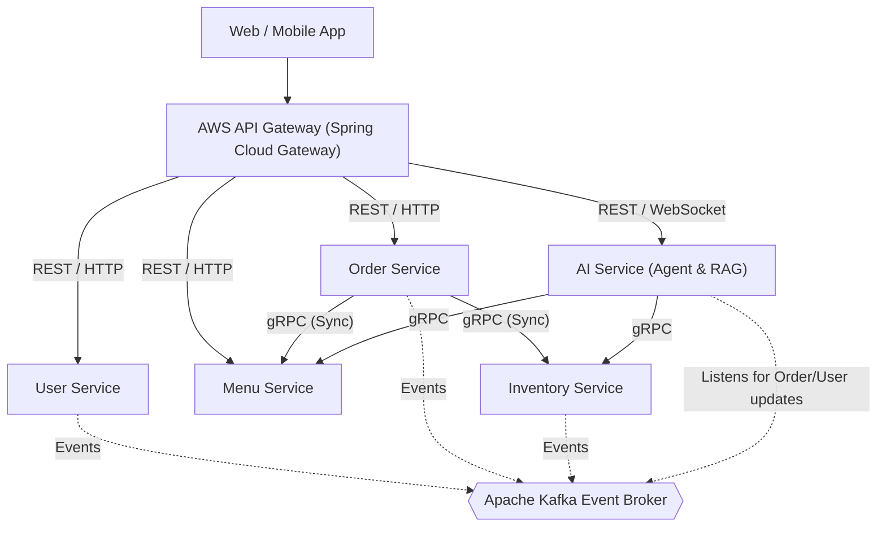
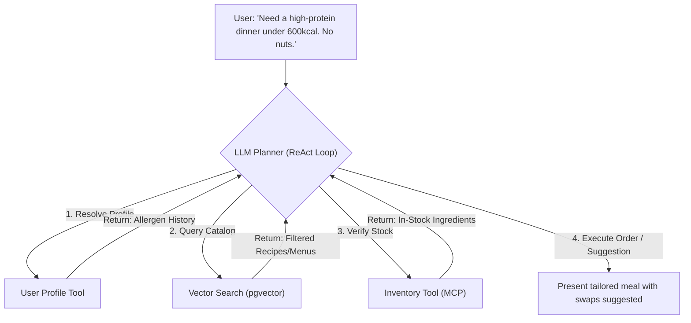
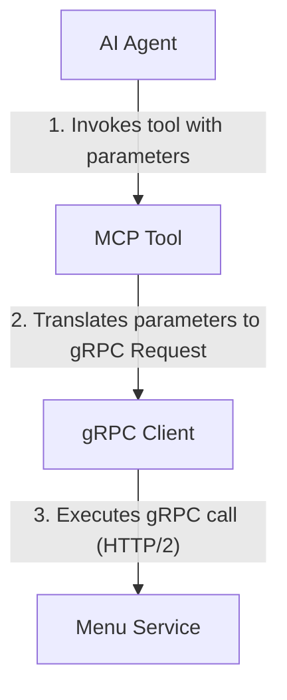

# Mealio System Overview
## AI-Agentic Food Ordering & Nutrition Platform

**Author:** Principal Software Architect  
**Version:** 1.0.0  
**Status:** Approved  

---

## 1. Vision

Mealio is an AI Agentic Food Ordering and Nutrition Platform that combines modern microservice architecture with AI Agents to provide personalized meal recommendations, nutrition tracking, and intelligent ordering experiences.
---

## 2. Business Objectives
*   **Reduced Order Attrition**: Lower drop-off rates during ordering by using conversational AI to resolve complex dietary queries (e.g., "Show me low-sodium dinners that fit my remaining macros for today").
*   **Operational Efficiency**: Maximize kitchen throughput and minimize ingredient waste by linking AI demand forecasting directly with real-time inventory tracking.
*   **Ecosystem Openness**: Establish Mealio as an open hub by providing Model Context Protocol (MCP) integrations for third-party wearers, health apps, and smart kitchen appliances.
*   **Enterprise Extensibility**: Support a multi-tenant model enabling restaurant brands to white-label the ordering engine while utilizing centralized AI recommendation models.

---

## 3. Functional Requirements

### 3.1 User & Profile Management
*   **Dietary Profiling**: Users can input and update chronic health conditions (e.g., Type 2 Diabetes, hypertension), allergen restrictions (e.g., gluten-free, peanut allergy), and macronutrient targets.
*   **Biometric Integration**: Securely import calorie and activity data from Apple Health, Google Fit, and wearable devices to adjust real-time dietary requirements.

### 3.2 Conversational & Agentic Ordering
*   **Conversational Interface**: Allow users to place complex, multi-item orders using natural language via voice or text.
*   **Dynamic Customization**: The system must automatically suggest ingredient swaps to satisfy user constraints (e.g., swapping white rice for cauliflower rice to meet low-carb thresholds).
*   **Group Ordering Agent**: An AI agent that coordinates preferences across multiple users to suggest a shared menu or catering list satisfying everyone's diet.

### 3.3 Menu & Inventory Operations
*   **Dynamic Pricing**: Adjust menu item prices in real-time based on local demand, ingredient shelf-life, and user subscription tiers.
*   **Real-time Stock Hard-Locking**: Reserve inventory items during the checkout flow to prevent double-ordering of limited ingredients.

---

## 4. Non-Functional Requirements

### 4.1 Performance & Latency
*   **API Response Time**: 95% of standard REST/gRPC endpoints (User, Menu, Order) must respond in under **100ms**.
*   **AI Agent Latency**: Streaming LLM responses must begin within **800ms** of user submission, with agentic planning cycles (multi-tool calls) completing in under **2.5 seconds**.

### 4.2 Scalability & Availability
*   **Throughput**: Scale dynamically to handle **10,000 concurrent transactions** during peak lunch and dinner hours.
*   **Availability**: Target high availability of **99.99% (four nines)** for core ordering services, with graceful degradation to fallback heuristic engines if AI models go offline.

### 4.3 Security & Compliance
*   **HIPAA & GDPR Compliance**: Secure and encrypt all personal health information (PHI) and personally identifiable information (PII) both at rest (AES-256) and in transit (TLS 1.3).
*   **Fine-Grained Auditing**: Maintain immutable logs of AI agent decisions to explain *why* a certain meal swap or recommendation was made.

---

## 5. High-Level Architecture

### 5.1 Core Architecture Principle: AI is NOT the Application

A fundamental design principle of Mealio is that **AI is NOT the application; AI is an intelligent layer on top of a traditional, robust backend**. 

```
                 Frontend
                     │
             Spring Gateway
                     │
     ┌───────────────┼───────────────┐
     ▼               ▼               ▼
  Menu API      Order API      User API
                     │
              Inventory API
                     │
               AI Service
                     │
              MCP Tool Layer
                     │
             LLM + RAG Engine
```

*   **Loose Coupling and Graceful Degradation**: The core microservices (Menu, Order, User, Inventory) are fully functional standalone systems. The backend can run perfectly even if the AI Service is completely offline.
*   **Decoupled Intelligence**: The AI Service acts as an advisory/intelligent layer, querying core backend services via gRPC and REST. It does not dictate or intercept transactional state changes.
*   **Production-Grade Reliability**: This design mirrors real-world production systems where LLM latency, model failure, or third-party provider downtime must never compromise critical transactional flows (such as order placement and payments).

### 5.2 System Components and Ingress Flow

The Mealio platform uses a clean, cloud-native microservices architecture split into clear layers: the Edge/Ingress layer, Core Business Domain services, the Event-Driven Message Backbone, and the AI/RAG Engine.



---

## 6. Microservice Architecture

Mealio is built using a domain-driven microservice pattern, ensuring that domains are isolated, highly cohesive, and loosely coupled.

### 6.1 `mealio-user-service`
*   **Domain**: Manages user registration, profiles, health configurations, and security credentials.
*   **Technology**: Spring Boot, Spring Security (OAuth2/OIDC), PostgreSQL.

### 6.2 `mealio-menu-service`
*   **Domain**: Manages restaurant listings, dish details, ingredients, allergens, pricing, and classifications.
*   **Technology**: Spring Boot, PostgreSQL, Redis (for high-speed menu reading).

### 6.3 `mealio-order-service`
*   **Domain**: Manages carts, checkouts, state transitions of orders (Created, Paid, Preparing, Dispatched, Delivered), and payment gateways.
*   **Technology**: Spring Boot, Spring State Machine, PostgreSQL.

### 6.4 `mealio-inventory-service`
*   **Domain**: Tracks raw ingredients and real-time stocks at restaurant locations. Handles distributed transactions to lock inventory during checkout.
*   **Technology**: Spring Boot, PostgreSQL, Redis (for tracking stock lock expirations).

### 6.5 `mealio-ai-service`
*   **Domain**: Orchestrates AI workflows, agent reasoning loops, LLM token streaming, nutritional RAG pipelines, and vector searches.
*   **Technology**: Python / FastAPI (or Java with Spring AI), pgvector, LangChain/LangGraph.

---

## 7. AI Agent Architecture

The AI subsystem uses an **agentic pattern** rather than a static prompt chain. The agent operates in a closed loop (Reasoning & Acting) to satisfy complex user queries.



### 7.1 Agent Execution Cycle (ReAct)
1.  **Parse & Plan**: The agent parses user natural language inputs and extracts constraints (macros, allergens, preferences).
2.  **Tool Execution via MCP (Model Context Protocol)**:
    *   `ProfileMCPTool`: Fetches user's current health profile and active fitness data.
    *   `MenuMCPTool`: Queries the database for dishes matching nutritional criteria.
    *   `StockMCPTool`: Queries live inventory to verify that the kitchen has the fresh ingredients needed for the requested dish.
3.  **Refinement**: If ingredients are out of stock, the agent loops back to substitute ingredients or suggest alternative dishes.

### 7.2 RAG (Retrieval-Augmented Generation) Pipeline
*   **Ingestion**: Nutritional guidelines, recipe catalogs, and clinical dietary standards are vectorized and saved in **pgvector**.
*   **Retrieval**: When a query is analyzed, semantic search queries the vector store to fetch relevant medical warnings or recipe tips to insert into the LLM context windows.

### 7.3 AI Communication Flow

The interaction between the AI subsystem and domain microservices follows a structured invocation chain:



*   **AI Agent**: The LLM reasoning and planning engine. Evaluates user intent and decides to call a tool to retrieve domain data.
*   **MCP Tool**: A local tool wrapper that defines tool schemas (e.g. `MenuMCPTool`) for the LLM. It receives unstructured tool call inputs.
*   **gRPC Client**: Embedded in the AI service, it translates tool inputs into structured Protobuf objects.
*   **Menu Service**: The downstream microservice that processes the gRPC call and returns target data.

### 7.4 AI Safety Principles

To ensure system predictability, reliability, and security, the AI orchestration engine is bound by strict safety principles:

1.  **AI Never Directly Modifies Databases**: The AI service has zero database write access. All modifications must go through backend service endpoints with full validation.
2.  **AI Never Owns Business Rules**: Business rules, validation constraints, calculations (like price calculations or order validation), and state changes are strictly owned and executed by backend microservices.
3.  **AI Interacts Only Through MCP Tools**: The AI engine cannot directly make database calls, external network calls, or write/read state. It can only execute actions through predefined, schema-validated MCP Tools.
4.  **Backend Services Remain the Source of Truth**: The core microservices are the final authority on system state, access control, and transaction validity.
5.  **Every AI Action Must Be Explainable and Auditable**: All agent choices, tool selections, inputs/outputs, and reasoning traces must be recorded in immutable audit logs for verification and troubleshooting.

---

## 8. Communication Pattern

Mealio uses a hybrid communication pattern designed for low latency, reliability, and event-driven microservices.

```
+------------------+                   +--------------------+
|  Client Device   |                   |    API Gateway     |
+--------+---------+                   +---------+----------+
         |                                       |
         | -------- 1. HTTPS REST / WS --------> |
         |                                       | ---- 2. Internal gRPC (Sync) ---> [ Microservices ]
         |                                       |
         |                                       | -.-- 3. Kafka Publish (Async) -> [ Kafka Cluster ]
```

### 8.1 Synchronous Communication
*   **External Traffic**: Clients connect to the API Gateway via HTTP/REST for standard JSON APIs or WebSockets for real-time AI conversation streams.
*   **Internal Traffic (gRPC)**: Microservices communicate with each other using **gRPC** over HTTP/2. This guarantees:
    *   Strict contract compliance via Protocol Buffers.
    *   Low latency serialization and multiplexed networking.
    *   Strong typed client SDK generation.

### 8.2 Asynchronous Communication
*   **Message Broker**: **Apache Kafka** manages business events asynchronously.
*   **Key Event Categories**:
    *   `OrderPlacedEvent`: Emitted by `order-service` to alert `inventory-service` to reduce stock permanently.
    *   `InventoryDepletedEvent`: Emitted by `inventory-service` to signal `menu-service` to temporarily mark an item out of stock.
    *   `UserHealthProfileUpdatedEvent`: Prompts `ai-service` to rebuild and cache user embedding vectors in the background.

---

## 9. Database Strategy

Mealio follows the **Database per Service** design pattern to guarantee structural independence, loose coupling, and individual service scalability.

```
+-----------------------+      +-----------------------+      +-----------------------+
|  mealio-user-service  |      |  mealio-order-service  |      |   mealio-ai-service   |
+-----------+-----------+      +-----------+-----------+      +-----------+-----------+
            |                              |                              |
      [ PostgreSQL ]                 [ PostgreSQL ]                 [ pgvector DB ]
 (User Profile & Security)        (Transactional Orders)        (Embeddings & Vectors)
```

### 9.1 Database Distribution
*   **User Service**: PostgreSQL storing relational user demographic and credential configurations.
*   **Menu Service**: PostgreSQL for complex relational catalogs, wrapped with **Redis Cache** (Read-Aside strategy) to achieve sub-millisecond query performance for standard menu requests.
*   **Order Service**: PostgreSQL utilizing ACID compliance to manage monetary transactions and order states.
*   **Inventory Service**: PostgreSQL using row-level locking during checkout to prevent concurrency issues.
*   **AI Service**: PostgreSQL configured with the **pgvector** extension. This allows us to store user taste vectors, meal history profiles, and recipe embeddings in a single relational system, facilitating unified relational-vector database queries.

---

## 10. Technology Stack

### 10.1 Backend Core
*   **Language**: Java 17 LTS (for enterprise stability and modern language constructs).
*   **Framework**: Spring Boot 3.x (Spring Data JPA, Spring Security, Spring WebFlux for reactive endpoints).
*   **Build Tool**: Gradle (using Kotlin DSL for monorepo project definition).

### 10.2 AI & Machine Learning
*   **Runtime**: Python 3.11 (FastAPI/LangChain for LLM integration, or Spring AI for unified Java-based AI processing).
*   **Vector Engine**: `pgvector` running on PostgreSQL.
*   **LLM Providers**: Google Gemini 1.5 Pro / Flash (accessed via API for tool use and long-context reasoning).

### 10.3 Messaging, Cache, & Storage
*   **Event Pipeline**: Apache Kafka.
*   **Cache / Locks**: Redis (used for session storage, menu caches, and distributed transaction locks).
*   **Relational Engine**: PostgreSQL 15+.

---

## 11. Deployment Architecture

Mealio is deployed in a cloud-native, containerized architecture using Amazon Web Services (AWS).

```
[ Ingress: AWS Route 53 ]
        │
[ AWS CloudFront (CDN) ]
        │
[ AWS Application Load Balancer (ALB) ]
        │
[ Amazon ECS (Elastic Container Service) on AWS Fargate ]
   ├── service: Spring Cloud Ingress Gateway
   ├── services: mealio-user-service, mealio-order-service, etc.
   └── service: mealio-ai-service (configured with GPU/vCPU task definitions)
        │
   ├─[ Amazon ElastiCache (Redis) ]
   ├─[ Amazon RDS Multi-AZ (PostgreSQL + pgvector) ]
   └─[ Amazon MSK (Managed Streaming for Apache Kafka) ]
```

### 11.1 Infrastructure Components
*   **Container Orchestration**: **Amazon ECS** (Elastic Container Service) utilizing **AWS Fargate** serverless compute for running microservices across multiple Availability Zones without managing cluster instances.
*   **Managed Databases**: **Amazon RDS** for PostgreSQL (configured with Multi-AZ replication).
*   **Managed Kafka**: **Amazon MSK** (Managed Streaming for Apache Kafka) to remove message broker maintenance overhead.
*   **Static Asset Delivery**: AWS CloudFront serving static content globally with low latency.

---

## 12. Development Principles

To build a clean, maintainable, and reliable monorepo, our development workflows abide by:

*   **API-First Development**: We design REST OpenAPI specifications and Protobuf schemas (`mealio-contracts`) *before* writing application code. Changes to APIs are pull-requested, discussed, and versioned beforehand.
*   **Clean Architecture**: Domain logic is decoupled from frameworks, transport layers (controllers/gRPC handlers), and database models.
*   **Test-Driven Development (TDD)**:
    *   Unit tests are written for all domain logic and core classes.
    *   Integration tests verify microservice database connections using **Testcontainers**.
*   **SOLID Principles**: Strictly follow object-oriented design principles to write decoupled, single-responsibility, and highly testable modules.

---

## 13. Future Roadmap

### Phase 1: Foundation (Current)
*   Establish monorepo structure, build pipelines, and base Spring Boot microservices.
*   Develop basic schemas in `mealio-contracts` (gRPC and Kafka event schemas).
*   Write basic integration tests.

### Phase 2: Agent Integration
*   Deploy `mealio-ai-service` and integrate Google Gemini API.
*   Implement pgvector store with RAG pipeline for recipe lookup and basic ingredient swaps.
*   Build the primary MCP tools to bridge LLM queries to backend services.

### Phase 3: Biometric & Health Integration
*   Integrate third-party fitness APIs (Apple HealthKit, Google Fit API).
*   Enhance recommendation loops to ingest real-time calorie burn data.
*   Implement real-time dynamic pricing based on stock shelf-life alerts.
